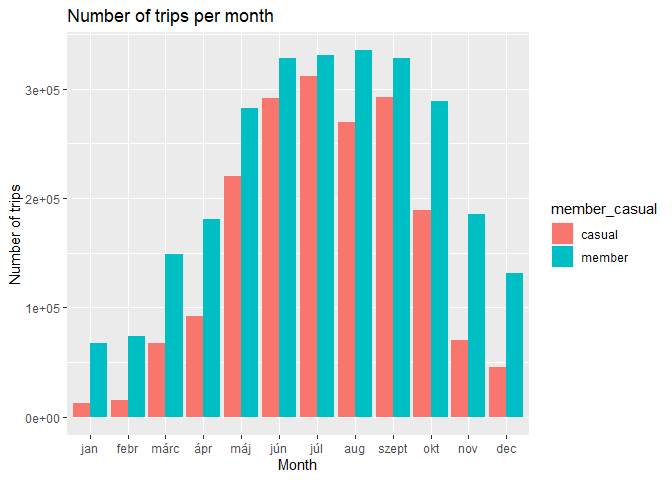

Cyclistic Bike-Share Case Study - Google Data Analytics Capstone Project
================
Anna Mándoki
2022-10-12


## Introduction

This case study is my capstone project for the Google Data Analytics
Professional Certificate course.

In this project, I am assuming the role of a Junior Data Analyst working
in the marketing team at a fictional bike-sharing company called
Cyclistic. I am going to perform analysis on historical bicycle trip
data in order to identify trends that would help design the company’s
marketing strategies, aimed at converting casual riders into annual
members.

## About Cyclistic

In 2016, Cyclistic launched a bike-share program that currently operates
a fleet of 5,824 bicycles that are geotracked and locked into a network
of 692 stations across Chicago. The bikes can be unlocked from one
station and returned to any other station in the system at anytime.

Over the years, Cyclistic’s marketing strategy relied on building
general awareness and appealing to broad consumer segments by offering
flexible pricing plans: single-ride passes, full-day passes, and annual
memberships.

Customers who purchase single-ride or full-day passes are referred to as
casual riders. Customers who purchase annual memberships are Cyclistic
members.

Lately, analyses have shown that annual members are much more profitable
than casual riders. Therefore, Cyclistic’s Director of Marketing, Lily
Moreno set the goal to maximize the number of annual members, as she
believes this strategy would be the key to future growth.

## Ask Phase

### Business objective

**Design marketing strategies aimed at converting casual riders into
annual members to increase future profitability.**

Questions that will guide the future marketing program:

1.  How do annual members and casual riders use Cyclistic bikes
    differently?
2.  Why would casual riders buy Cyclistic annual memberships?
3.  How can Cyclistic use digital media to influence casual riders to
    become members?

### Business Task for the Junior Data Analyst

As a Junior Data Analyst in the team, I have been assigned to answer to
first question:

- **How do annual members and casual riders use Cyclistic bikes
  differently?**

### Stakeholders

- **Lily Moreno**: She is the Director of Marketing and my manager. She
  is responsible for the development of marketing campaigns and
  initiatives to promote the bike-share program.
- **Cyclistic Marketing Analytics Team**: They are responsible for
  collecting, analyzing, and reporting data that helps guide Cyclistic
  marketing strategy. I am a Junior Data Analyst in this team.
- **Cyclistic Executive Team**: They make the final decision on the
  recommended marketing program. They are notoriously detail-oriented.

## Prepare Phase

### Dataset location

The datasets are provided by the Course, assumed to be provided directly
by the fictional company. The datasets can be downloaded from the
following website: <https://divvy-tripdata.s3.amazonaws.com/index.html>

Note: The datasets have a different name because Cyclistic is a
fictional company. For the purposes of this case study, the datasets are
appropriate and will enable us to answer the business questions. The
data has been made available by Motivate International Inc. under this
[licence](https://ride.divvybikes.com/data-license-agreement)

### Data organization

The data is organized in monthly csv files. For this case study, the
previous 12 months of trip data were used: September 2021 - August 2022,
as of October 06, 2022. The files contain 13 columns including
information on rider types, bike types, start and end times, station
names etc.

### Credibility and bias

- **Reliable**: The data is accurate, unbiased, fit for use, however
  there is a number of missing data regarding station names and station
  IDs.
- **Original**: The original source can be located, the data has been
  made available by Motivate International Inc, a company that services
  bike-sharing systems in North America.
- **Comprehensive**: The datasets contain all of the critical
  information.
- **Current**: Datasets are released on a monthly basis.
- **Cited**

### Licensing, privacy, security

The data is anonymized; it contains no personally identifiable
information, such as home addresses, telephone numbers, credit card
numbers. Privacy in ensured. As mentioned above, the data is released
under this
[licence](https://ride.divvybikes.com/data-license-agreement).

### Is the data helpful in answering the question in the Business Task?

To be able to answer the business question, it is crucial to identify
and differentiate the two rider types: casual riders and members. There
is a column in the dataset containing this information.

### Problems with the data

After a first glance at the data, it seems there are missing station
names. Let’s see what else we can find during the Process Phase.

### Key steps taken

- Downloaded data and stored on computer
- Identified how the data is organized
- Took a first look at the data using LibreOffice Calc
- Determined credibility of the data.

## Process Phase

### Tools

I chose RStudio Desktop to clean and analyze the data, due to the size
of the dataset.

(I attempted to upload and open one of the csv files in Google
Spreadsheets, but the browser crashed as the file was huge.)

### Setting up my environment

``` r
library(tidyverse)
```

    ## ── Attaching packages ─────────────────────────────────────── tidyverse 1.3.2 ──
    ## ✔ ggplot2 3.3.6      ✔ purrr   0.3.4 
    ## ✔ tibble  3.1.8      ✔ dplyr   1.0.10
    ## ✔ tidyr   1.2.1      ✔ stringr 1.4.1 
    ## ✔ readr   2.1.2      ✔ forcats 0.5.2 
    ## ── Conflicts ────────────────────────────────────────── tidyverse_conflicts() ──
    ## ✖ dplyr::filter() masks stats::filter()
    ## ✖ dplyr::lag()    masks stats::lag()

``` r
library(lubridate)
```

    ## 
    ## Attaching package: 'lubridate'
    ## 
    ## The following objects are masked from 'package:base':
    ## 
    ##     date, intersect, setdiff, union

``` r
library(janitor)
```

    ## 
    ## Attaching package: 'janitor'
    ## 
    ## The following objects are masked from 'package:stats':
    ## 
    ##     chisq.test, fisher.test

``` r
library(ggplot2)
library(skimr)
```

### Data importing

Import all the data needed for the analysis: 12 csv files for the past
12 months.

``` r
trips_09_21 <- read.csv("202109-divvy-tripdata.csv")
trips_10_21 <- read.csv("202110-divvy-tripdata.csv")
trips_11_21 <- read.csv("202111-divvy-tripdata.csv")
trips_12_21 <- read.csv("202112-divvy-tripdata.csv")
trips_01_22 <- read.csv("202201-divvy-tripdata.csv")
trips_02_22 <- read.csv("202202-divvy-tripdata.csv")
trips_03_22 <- read.csv("202203-divvy-tripdata.csv")
trips_04_22 <- read.csv("202204-divvy-tripdata.csv")
trips_05_22 <- read.csv("202205-divvy-tripdata.csv")
trips_06_22 <- read.csv("202206-divvy-tripdata.csv")
trips_07_22 <- read.csv("202207-divvy-tripdata.csv")
trips_08_22 <- read.csv("202208-divvy-tripdata.csv")
```

Take a quick look at one of the monthly tables.

``` r
head(trips_03_22)
```

    ##            ride_id rideable_type          started_at            ended_at
    ## 1 47EC0A7F82E65D52  classic_bike 2022-03-21 13:45:01 2022-03-21 13:51:18
    ## 2 8494861979B0F477 electric_bike 2022-03-16 09:37:16 2022-03-16 09:43:34
    ## 3 EFE527AF80B66109  classic_bike 2022-03-23 19:52:02 2022-03-23 19:54:48
    ## 4 9F446FD9DEE3F389  classic_bike 2022-03-01 19:12:26 2022-03-01 19:22:14
    ## 5 431128AD9AFFEDC0  classic_bike 2022-03-21 18:37:01 2022-03-21 19:19:11
    ## 6 9AA8A13AF7A85325  classic_bike 2022-03-07 17:10:22 2022-03-07 17:15:04
    ##                   start_station_name start_station_id
    ## 1             Wabash Ave & Wacker Pl     TA1307000131
    ## 2              Michigan Ave & Oak St            13042
    ## 3              Broadway & Berwyn Ave            13109
    ## 4             Wabash Ave & Wacker Pl     TA1307000131
    ## 5 DuSable Lake Shore Dr & North Blvd           LF-005
    ## 6          Bissell St & Armitage Ave            13059
    ##                       end_station_name end_station_id start_lat start_lng
    ## 1             Kingsbury St & Kinzie St   KA1503000043  41.88688 -87.62603
    ## 2 Orleans St & Chestnut St (NEXT Apts)            620  41.90100 -87.62375
    ## 3                 Broadway & Ridge Ave          15578  41.97835 -87.65975
    ## 4           Franklin St & Jackson Blvd   TA1305000025  41.88688 -87.62603
    ## 5             Loomis St & Jackson Blvd          13206  41.91172 -87.62680
    ## 6         Southport Ave & Clybourn Ave   TA1309000030  41.91802 -87.65218
    ##    end_lat   end_lng member_casual
    ## 1 41.88918 -87.63851        member
    ## 2 41.89820 -87.63754        member
    ## 3 41.98404 -87.66027        member
    ## 4 41.87771 -87.63532        member
    ## 5 41.87794 -87.66201        member
    ## 6 41.92077 -87.66371        member

#### Comparing column names

Before merging the datasets, let’s find out if there are any mismatches
between column names.

``` r
compare_df_cols(trips_09_21, trips_10_21, trips_11_21, trips_12_21, trips_01_22, trips_02_22, trips_03_22, trips_04_22, trips_05_22, trips_06_22, trips_07_22, trips_08_22, return = "mismatch")
```

    ##  [1] column_name trips_09_21 trips_10_21 trips_11_21 trips_12_21 trips_01_22
    ##  [7] trips_02_22 trips_03_22 trips_04_22 trips_05_22 trips_06_22 trips_07_22
    ## [13] trips_08_22
    ## <0 rows> (or 0-length row.names)

The above result shows that there is no mismatch, column names are the
same across the tables.

We can proceed to the next step, which is to merge all the data (the 12
tables) into one single data frame.

#### Merging data

Create new data frame: ‘total_trips’

``` r
total_trips <- rbind(trips_09_21, trips_10_21, trips_11_21, trips_12_21, trips_01_22, trips_02_22, trips_03_22, trips_04_22, trips_05_22, trips_06_22, trips_07_22, trips_08_22)
```

Check out our new data frame.

``` r
glimpse(total_trips)
```

    ## Rows: 5,883,043
    ## Columns: 13
    ## $ ride_id            <chr> "9DC7B962304CBFD8", "F930E2C6872D6B32", "6EF7213790…
    ## $ rideable_type      <chr> "electric_bike", "electric_bike", "electric_bike", …
    ## $ started_at         <chr> "2021-09-28 16:07:10", "2021-09-28 14:24:51", "2021…
    ## $ ended_at           <chr> "2021-09-28 16:09:54", "2021-09-28 14:40:05", "2021…
    ## $ start_station_name <chr> "", "", "", "", "", "", "", "", "", "", "Clark St &…
    ## $ start_station_id   <chr> "", "", "", "", "", "", "", "", "", "", "TA13070001…
    ## $ end_station_name   <chr> "", "", "", "", "", "", "", "", "", "", "", "", "",…
    ## $ end_station_id     <chr> "", "", "", "", "", "", "", "", "", "", "", "", "",…
    ## $ start_lat          <dbl> 41.89000, 41.94000, 41.81000, 41.80000, 41.88000, 4…
    ## $ start_lng          <dbl> -87.68000, -87.64000, -87.72000, -87.72000, -87.740…
    ## $ end_lat            <dbl> 41.89, 41.98, 41.80, 41.81, 41.88, 41.88, 41.74, 41…
    ## $ end_lng            <dbl> -87.67, -87.67, -87.72, -87.72, -87.71, -87.74, -87…
    ## $ member_casual      <chr> "casual", "casual", "casual", "casual", "casual", "…

### Data Cleaning & Transformation

#### Find duplicates if any

Let’s check if there are any duplicates. We can suppose that all bike
rides should have a unique identifier, so the values in the ‘ride_id’
column should be unique.

We have a total of 5,883,043 rows = ’ride_id’s in our dataframe. Let’s
see how many unique values we have.

``` r
length(total_trips$ride_id)
```

    ## [1] 5883043

``` r
length(unique(total_trips$ride_id))
```

    ## [1] 5883043

The results are the same, consequently there is no duplicate entry.

#### Check bike type and rider type

``` r
unique(total_trips$rideable_type)
```

    ## [1] "electric_bike" "classic_bike"  "docked_bike"

``` r
unique(total_trips$member_casual)
```

    ## [1] "casual" "member"

Based on the results, we have three different bike types: electric,
classic and docked bike.

As expected, we have two types of riders: casual riders and members.

The above results also confirm that there are no typos or extra spaces
in these columns.

#### Another look at the structure

Take another look at the new data frame using the `str()` function to
learn more about the structure.

``` r
str(total_trips)
```

    ## 'data.frame':    5883043 obs. of  13 variables:
    ##  $ ride_id           : chr  "9DC7B962304CBFD8" "F930E2C6872D6B32" "6EF72137900BB910" "78D1DE133B3DBF55" ...
    ##  $ rideable_type     : chr  "electric_bike" "electric_bike" "electric_bike" "electric_bike" ...
    ##  $ started_at        : chr  "2021-09-28 16:07:10" "2021-09-28 14:24:51" "2021-09-28 00:20:16" "2021-09-28 14:51:17" ...
    ##  $ ended_at          : chr  "2021-09-28 16:09:54" "2021-09-28 14:40:05" "2021-09-28 00:23:57" "2021-09-28 15:00:06" ...
    ##  $ start_station_name: chr  "" "" "" "" ...
    ##  $ start_station_id  : chr  "" "" "" "" ...
    ##  $ end_station_name  : chr  "" "" "" "" ...
    ##  $ end_station_id    : chr  "" "" "" "" ...
    ##  $ start_lat         : num  41.9 41.9 41.8 41.8 41.9 ...
    ##  $ start_lng         : num  -87.7 -87.6 -87.7 -87.7 -87.7 ...
    ##  $ end_lat           : num  41.9 42 41.8 41.8 41.9 ...
    ##  $ end_lng           : num  -87.7 -87.7 -87.7 -87.7 -87.7 ...
    ##  $ member_casual     : chr  "casual" "casual" "casual" "casual" ...

#### Converting to datetime

I noticed that the values in the ‘started_at’ and ‘ended_at’ columns are
strings instead of datetime. I am going to change the values now, as I
want to use them later to calculate trip duration.

``` r
total_trips <- total_trips %>%
  mutate(started_at = ymd_hms(started_at), ended_at = ymd_hms(ended_at))
```

Let’s check out if the conversion was successful:

``` r
glimpse(total_trips)
```

    ## Rows: 5,883,043
    ## Columns: 13
    ## $ ride_id            <chr> "9DC7B962304CBFD8", "F930E2C6872D6B32", "6EF7213790…
    ## $ rideable_type      <chr> "electric_bike", "electric_bike", "electric_bike", …
    ## $ started_at         <dttm> 2021-09-28 16:07:10, 2021-09-28 14:24:51, 2021-09-…
    ## $ ended_at           <dttm> 2021-09-28 16:09:54, 2021-09-28 14:40:05, 2021-09-…
    ## $ start_station_name <chr> "", "", "", "", "", "", "", "", "", "", "Clark St &…
    ## $ start_station_id   <chr> "", "", "", "", "", "", "", "", "", "", "TA13070001…
    ## $ end_station_name   <chr> "", "", "", "", "", "", "", "", "", "", "", "", "",…
    ## $ end_station_id     <chr> "", "", "", "", "", "", "", "", "", "", "", "", "",…
    ## $ start_lat          <dbl> 41.89000, 41.94000, 41.81000, 41.80000, 41.88000, 4…
    ## $ start_lng          <dbl> -87.68000, -87.64000, -87.72000, -87.72000, -87.740…
    ## $ end_lat            <dbl> 41.89, 41.98, 41.80, 41.81, 41.88, 41.88, 41.74, 41…
    ## $ end_lng            <dbl> -87.67, -87.67, -87.72, -87.72, -87.71, -87.74, -87…
    ## $ member_casual      <chr> "casual", "casual", "casual", "casual", "casual", "…

The ‘started_at’ and ‘ended_at’ columns now contain date time values. We
can use them to calculate trip duration later.

#### Handle missing values

Let’s continue with the data cleaning. Find out if there are any missing
values by counting NA values.

``` r
sum(is.na(total_trips))
```

    ## [1] 11454

It seems there are a number of NA values, now find out which columns
have these NA values.

``` r
map(total_trips, ~sum(is.na(.)))
```

    ## $ride_id
    ## [1] 0
    ## 
    ## $rideable_type
    ## [1] 0
    ## 
    ## $started_at
    ## [1] 0
    ## 
    ## $ended_at
    ## [1] 0
    ## 
    ## $start_station_name
    ## [1] 0
    ## 
    ## $start_station_id
    ## [1] 0
    ## 
    ## $end_station_name
    ## [1] 0
    ## 
    ## $end_station_id
    ## [1] 0
    ## 
    ## $start_lat
    ## [1] 0
    ## 
    ## $start_lng
    ## [1] 0
    ## 
    ## $end_lat
    ## [1] 5727
    ## 
    ## $end_lng
    ## [1] 5727
    ## 
    ## $member_casual
    ## [1] 0

Based on the above, ‘end_lat’ and ‘end_lng’ columns have NA values.

However, I noticed in previous glimpses that ‘start_station_name’ and
‘end_station_name’ columns have a lot of missing values as well, that
appear as empty strings”“.

Filter out rows with empty ‘start_station_name’.

``` r
start_station_empty <- total_trips %>% filter(start_station_name == "")
glimpse(start_station_empty)
```

    ## Rows: 884,365
    ## Columns: 13
    ## $ ride_id            <chr> "9DC7B962304CBFD8", "F930E2C6872D6B32", "6EF7213790…
    ## $ rideable_type      <chr> "electric_bike", "electric_bike", "electric_bike", …
    ## $ started_at         <dttm> 2021-09-28 16:07:10, 2021-09-28 14:24:51, 2021-09-…
    ## $ ended_at           <dttm> 2021-09-28 16:09:54, 2021-09-28 14:40:05, 2021-09-…
    ## $ start_station_name <chr> "", "", "", "", "", "", "", "", "", "", "", "", "",…
    ## $ start_station_id   <chr> "", "", "", "", "", "", "", "", "", "", "", "", "",…
    ## $ end_station_name   <chr> "", "", "", "", "", "", "", "", "", "", "", "", "",…
    ## $ end_station_id     <chr> "", "", "", "", "", "", "", "", "", "", "", "", "",…
    ## $ start_lat          <dbl> 41.89, 41.94, 41.81, 41.80, 41.88, 41.87, 41.74, 41…
    ## $ start_lng          <dbl> -87.68, -87.64, -87.72, -87.72, -87.74, -87.75, -87…
    ## $ end_lat            <dbl> 41.89, 41.98, 41.80, 41.81, 41.88, 41.88, 41.74, 41…
    ## $ end_lng            <dbl> -87.67, -87.67, -87.72, -87.72, -87.71, -87.74, -87…
    ## $ member_casual      <chr> "casual", "casual", "casual", "casual", "casual", "…

There are indeed a huge number of rows with empty ‘start_station_name’
and ‘end_station_name’.

#### Create new data frame to start remove data

As I am about to remove a larger amount of data, I am going to create a
new data frame: ‘total_trips_v2’. I can still use ‘total_trips’ as a
backup, in case it’s needed.

First, I am removing the rows where ‘end_lat’ and ‘end_lng’ columns
contain NA values.

``` r
total_trips_v2 <- total_trips[!(is.na(total_trips$end_lat) | is.na(total_trips$end_lng)),]

glimpse(total_trips_v2)
```

    ## Rows: 5,877,316
    ## Columns: 13
    ## $ ride_id            <chr> "9DC7B962304CBFD8", "F930E2C6872D6B32", "6EF7213790…
    ## $ rideable_type      <chr> "electric_bike", "electric_bike", "electric_bike", …
    ## $ started_at         <dttm> 2021-09-28 16:07:10, 2021-09-28 14:24:51, 2021-09-…
    ## $ ended_at           <dttm> 2021-09-28 16:09:54, 2021-09-28 14:40:05, 2021-09-…
    ## $ start_station_name <chr> "", "", "", "", "", "", "", "", "", "", "Clark St &…
    ## $ start_station_id   <chr> "", "", "", "", "", "", "", "", "", "", "TA13070001…
    ## $ end_station_name   <chr> "", "", "", "", "", "", "", "", "", "", "", "", "",…
    ## $ end_station_id     <chr> "", "", "", "", "", "", "", "", "", "", "", "", "",…
    ## $ start_lat          <dbl> 41.89000, 41.94000, 41.81000, 41.80000, 41.88000, 4…
    ## $ start_lng          <dbl> -87.68000, -87.64000, -87.72000, -87.72000, -87.740…
    ## $ end_lat            <dbl> 41.89, 41.98, 41.80, 41.81, 41.88, 41.88, 41.74, 41…
    ## $ end_lng            <dbl> -87.67, -87.67, -87.72, -87.72, -87.71, -87.74, -87…
    ## $ member_casual      <chr> "casual", "casual", "casual", "casual", "casual", "…

#### Decide how to handle missing station names

As for the missing station names, there are two options to handle the
situation:

1.  Try to find out the station names from the coordinates available.
2.  Remove the rows containing the missing values (empty strings).

In a real life scenario, I would discuss this with the stakeholders to
figure out the best way to handle this.

For the sake of this exercise, I am proceeding with Option 2 - I am
removing the rows with the missing information in ‘start_station_name’
and ‘end_station_name’.

``` r
total_trips_v2 <- total_trips_v2[!(total_trips_v2$start_station_name == "" | total_trips_v2$end_station_name == ""),]

glimpse(total_trips_v2)
```

    ## Rows: 4,560,146
    ## Columns: 13
    ## $ ride_id            <chr> "E92C804563F261EC", "9ECA91210441E847", "3DAA144C4E…
    ## $ rideable_type      <chr> "classic_bike", "classic_bike", "classic_bike", "cl…
    ## $ started_at         <dttm> 2021-09-05 01:25:08, 2021-09-05 13:33:41, 2021-09-…
    ## $ ended_at           <dttm> 2021-09-05 01:35:46, 2021-09-05 14:06:08, 2021-09-…
    ## $ start_station_name <chr> "Wells St & Walton St", "Larrabee St & Armitage Ave…
    ## $ start_station_id   <chr> "TA1306000011", "TA1309000006", "TA1305000006", "KA…
    ## $ end_station_name   <chr> "Desplaines St & Kinzie St", "Clark St & Leland Ave…
    ## $ end_station_id     <chr> "TA1306000003", "TA1309000014", "TA1305000006", "TA…
    ## $ start_lat          <dbl> 41.89993, 41.91808, 41.88132, 41.88918, 41.90096, 4…
    ## $ start_lng          <dbl> -87.63443, -87.64375, -87.62952, -87.63851, -87.623…
    ## $ end_lat            <dbl> 41.88872, 41.96710, 41.88132, 41.90292, 41.90096, 4…
    ## $ end_lng            <dbl> -87.64445, -87.66743, -87.62952, -87.63772, -87.623…
    ## $ member_casual      <chr> "casual", "casual", "casual", "casual", "casual", "…

From 5,877,316 rows we have now 4,560,146 left.

#### Adding new columns by extracting information

- **Trip duration**

As mentioned in a previous step, I am calculating trip duration from
‘ended_at’ and ‘started_at’ to include the results in the data frame as
a new column.

``` r
total_trips_v2$duration <- difftime(total_trips_v2$ended_at, total_trips_v2$started_at)

total_trips_v2$duration <- as.numeric(as.character(total_trips_v2$duration))
```

- **Day of Week**

Calculating the day of the week when each ride started from the values
in the ‘started_at’ column.

``` r
total_trips_v2$day_of_week <- wday(total_trips_v2$started_at, label = TRUE, week_start = 1)
```

- **Month**

Calculating the month the same way as the day of week.

``` r
total_trips_v2$month <- month(total_trips_v2$started_at, label = TRUE, abbr = TRUE)
```

Check out our new set of columns:

``` r
glimpse(total_trips_v2)
```

    ## Rows: 4,560,146
    ## Columns: 16
    ## $ ride_id            <chr> "E92C804563F261EC", "9ECA91210441E847", "3DAA144C4E…
    ## $ rideable_type      <chr> "classic_bike", "classic_bike", "classic_bike", "cl…
    ## $ started_at         <dttm> 2021-09-05 01:25:08, 2021-09-05 13:33:41, 2021-09-…
    ## $ ended_at           <dttm> 2021-09-05 01:35:46, 2021-09-05 14:06:08, 2021-09-…
    ## $ start_station_name <chr> "Wells St & Walton St", "Larrabee St & Armitage Ave…
    ## $ start_station_id   <chr> "TA1306000011", "TA1309000006", "TA1305000006", "KA…
    ## $ end_station_name   <chr> "Desplaines St & Kinzie St", "Clark St & Leland Ave…
    ## $ end_station_id     <chr> "TA1306000003", "TA1309000014", "TA1305000006", "TA…
    ## $ start_lat          <dbl> 41.89993, 41.91808, 41.88132, 41.88918, 41.90096, 4…
    ## $ start_lng          <dbl> -87.63443, -87.64375, -87.62952, -87.63851, -87.623…
    ## $ end_lat            <dbl> 41.88872, 41.96710, 41.88132, 41.90292, 41.90096, 4…
    ## $ end_lng            <dbl> -87.64445, -87.66743, -87.62952, -87.63772, -87.623…
    ## $ member_casual      <chr> "casual", "casual", "casual", "casual", "casual", "…
    ## $ duration           <dbl> 638, 1947, 579, 587, 4, 6, 7466, 416, 429, 278, 175…
    ## $ day_of_week        <ord> V, V, Szo, K, H, K, Szo, K, H, Szo, H, V, P, Szo, K…
    ## $ month              <ord> szept, szept, szept, szept, szept, szept, szept, sz…

**Note:** Due to the system settings on my laptop, the calculated day
and month names are in Hungarian.

I will use these values to create some quick visualizations to get an
idea about the trends in the data. Most of the analysis and
visualizations will be done using *Tableau*, where these values will be
in English, for this reason I am not going to change them here.

#### Find and remove outliers

- **Negative duration**

Let’s see if there are any trip durations that are negative. There
shouldn’t be any ride that is less than 0 seconds long.

``` r
total_trips_v2 %>% select(ride_id, started_at, ended_at, duration) %>%
  filter(duration <= 0) %>%
  head(., 10)
```

    ##             ride_id          started_at            ended_at duration
    ## 1  BE93718DC9182ED6 2021-09-29 17:04:38 2021-09-29 17:04:27      -11
    ## 2  26425AD2A79DB7A8 2021-09-14 15:01:34 2021-09-14 15:01:34        0
    ## 3  6E5FD2F624AC87D3 2021-09-01 17:49:37 2021-09-01 17:49:31       -6
    ## 4  FA4DC99A39C36D54 2021-09-29 16:53:34 2021-09-29 16:53:29       -5
    ## 5  74BFD8D41928FEAD 2021-09-29 12:00:06 2021-09-29 12:00:06        0
    ## 6  85BC495341AB2F18 2021-09-01 18:45:38 2021-09-01 18:45:24      -14
    ## 7  4A68473D329D45C9 2021-09-29 18:42:50 2021-09-29 18:36:24     -386
    ## 8  8B8CB2879D0A664F 2021-09-19 22:38:04 2021-09-19 22:38:04        0
    ## 9  DB9D07704E3285A8 2021-09-29 16:10:02 2021-09-29 16:09:59       -3
    ## 10 E6B7496F362E98A5 2021-09-10 18:52:05 2021-09-10 18:52:05        0

Remove rows with negative values.

``` r
total_trips_v2 <- total_trips_v2[total_trips_v2$duration > 0,]
```

- **Extreme long duration**

Filter the data to find out if there are any extreme long durations.
Duration is in seconds.

Let’s do some calculations:

``` r
mean(total_trips_v2$duration)
```

    ## [1] 1080.035

``` r
min(total_trips_v2$duration)
```

    ## [1] 1

``` r
max(total_trips_v2$duration)
```

    ## [1] 2442301

- The average duration is 1080.035 seconds = 18 minutes, seems
  realistic.
- The minimum duration is 1 second, not likely, but it can be realistic.
- The maximum duration is 2442301 seconds = more than 678 hours = 28
  days, not so realistic.

Filter out extreme durations. If a duration is more than 43,200 seconds
= 12 hours, I would consider it extreme.

``` r
total_trips_v2 %>% select(ride_id, started_at, ended_at, duration) %>%
  filter(duration > 43200) %>%
  head(., 10)
```

    ##             ride_id          started_at            ended_at duration
    ## 1  9E5D2B66D78D4520 2021-09-15 15:01:51 2021-09-22 13:28:05   599174
    ## 2  291AE1A7D3426391 2021-09-06 10:15:32 2021-09-11 13:49:01   444809
    ## 3  F0514A76B7E2CF53 2021-09-05 17:58:28 2021-09-09 10:51:40   319992
    ## 4  1E56FBA13C706817 2021-09-04 20:41:32 2021-09-07 13:30:34   233342
    ## 5  B9D0233713815746 2021-09-10 22:25:14 2021-09-11 14:08:52    56618
    ## 6  EFBCECA910C4F129 2021-09-28 22:37:10 2021-09-29 13:11:27    52457
    ## 7  86F0FA616038DE15 2021-09-04 19:33:16 2021-09-07 17:07:03   250427
    ## 8  2E4A2489DB274EBF 2021-09-21 17:32:47 2021-09-22 13:57:44    73497
    ## 9  2C00D3651F8D7E1A 2021-09-12 16:53:12 2021-09-13 17:03:00    86988
    ## 10 F8C78A55FF082865 2021-09-28 20:30:10 2021-09-29 14:31:10    64860

Remove rows with extreme duration values.

``` r
total_trips_v2 <- total_trips_v2[total_trips_v2$duration < 43200, ]

glimpse(total_trips_v2)
```

    ## Rows: 4,557,530
    ## Columns: 16
    ## $ ride_id            <chr> "E92C804563F261EC", "9ECA91210441E847", "3DAA144C4E…
    ## $ rideable_type      <chr> "classic_bike", "classic_bike", "classic_bike", "cl…
    ## $ started_at         <dttm> 2021-09-05 01:25:08, 2021-09-05 13:33:41, 2021-09-…
    ## $ ended_at           <dttm> 2021-09-05 01:35:46, 2021-09-05 14:06:08, 2021-09-…
    ## $ start_station_name <chr> "Wells St & Walton St", "Larrabee St & Armitage Ave…
    ## $ start_station_id   <chr> "TA1306000011", "TA1309000006", "TA1305000006", "KA…
    ## $ end_station_name   <chr> "Desplaines St & Kinzie St", "Clark St & Leland Ave…
    ## $ end_station_id     <chr> "TA1306000003", "TA1309000014", "TA1305000006", "TA…
    ## $ start_lat          <dbl> 41.89993, 41.91808, 41.88132, 41.88918, 41.90096, 4…
    ## $ start_lng          <dbl> -87.63443, -87.64375, -87.62952, -87.63851, -87.623…
    ## $ end_lat            <dbl> 41.88872, 41.96710, 41.88132, 41.90292, 41.90096, 4…
    ## $ end_lng            <dbl> -87.64445, -87.66743, -87.62952, -87.63772, -87.623…
    ## $ member_casual      <chr> "casual", "casual", "casual", "casual", "casual", "…
    ## $ duration           <dbl> 638, 1947, 579, 587, 4, 6, 7466, 416, 429, 278, 175…
    ## $ day_of_week        <ord> V, V, Szo, K, H, K, Szo, K, H, Szo, H, V, P, Szo, K…
    ## $ month              <ord> szept, szept, szept, szept, szept, szept, szept, sz…

Check out remaining maximum trip duration.

``` r
max(total_trips_v2$duration)
```

    ## [1] 43193

#### Remove redundant data

I decided to remove ‘start_station_id’ and ‘end_station_id’ columns as
they don’t provide any additional information. We will still have
station names and coordinates.

``` r
drops <- c("start_station_id","end_station_id")
total_trips_v2 <- total_trips_v2[, !(names(total_trips_v2) %in% drops)]

glimpse(total_trips_v2)
```

    ## Rows: 4,557,530
    ## Columns: 14
    ## $ ride_id            <chr> "E92C804563F261EC", "9ECA91210441E847", "3DAA144C4E…
    ## $ rideable_type      <chr> "classic_bike", "classic_bike", "classic_bike", "cl…
    ## $ started_at         <dttm> 2021-09-05 01:25:08, 2021-09-05 13:33:41, 2021-09-…
    ## $ ended_at           <dttm> 2021-09-05 01:35:46, 2021-09-05 14:06:08, 2021-09-…
    ## $ start_station_name <chr> "Wells St & Walton St", "Larrabee St & Armitage Ave…
    ## $ end_station_name   <chr> "Desplaines St & Kinzie St", "Clark St & Leland Ave…
    ## $ start_lat          <dbl> 41.89993, 41.91808, 41.88132, 41.88918, 41.90096, 4…
    ## $ start_lng          <dbl> -87.63443, -87.64375, -87.62952, -87.63851, -87.623…
    ## $ end_lat            <dbl> 41.88872, 41.96710, 41.88132, 41.90292, 41.90096, 4…
    ## $ end_lng            <dbl> -87.64445, -87.66743, -87.62952, -87.63772, -87.623…
    ## $ member_casual      <chr> "casual", "casual", "casual", "casual", "casual", "…
    ## $ duration           <dbl> 638, 1947, 579, 587, 4, 6, 7466, 416, 429, 278, 175…
    ## $ day_of_week        <ord> V, V, Szo, K, H, K, Szo, K, H, Szo, H, V, P, Szo, K…
    ## $ month              <ord> szept, szept, szept, szept, szept, szept, szept, sz…

### Key steps taken in the Process Phase

- Setting up RStudio environment; loading packages
- Importing 12 csv files for the previous 12 month and merging them into
  one single data frame
- Data cleaning & transformation:
  - Find duplicates if any
  - Check structure of the data
    - Converting chr to datetime
    - Handle missing values
    - Create new data frame for cleaned data
    - Remove rows with missing values
    - Add new columns for extracted features
    - Find and remove outliers
    - Remove redundant data

### Export data frame

Now is a good time to export the cleaned data frame to a csv file. The
analysis will be conducted using this dataset.

``` r
#write.csv(total_trips_v2, "total_trips_v2.csv")
```

## Analyze Phase

I am going to look into the following:

- Statistical summary: mean, median, maximum and minimum ride duration
- Number of trips by rider type
- Number of trips per month by rider type
- Number of trips per weekday by rider type
- Average ride length by rider type
- Bike choice by rider type

#### Summary of ride duration

``` r
summary(total_trips_v2$duration)
```

    ##    Min. 1st Qu.  Median    Mean 3rd Qu.    Max. 
    ##       1     377     660    1031    1184   43193

#### Number of trips by rider type

``` r
total_trips_v2 %>%
  select(member_casual) %>%
  group_by(member_casual) %>%
  count()
```

    ## # A tibble: 2 × 2
    ## # Groups:   member_casual [2]
    ##   member_casual       n
    ##   <chr>           <int>
    ## 1 casual        1875899
    ## 2 member        2681631

Create a bar chart

``` r
ggplot(data = total_trips_v2) +
  geom_bar(mapping = aes(x = member_casual, fill = member_casual)) +
  labs(title = "Number of trips by Rider type", x = "Rider type", y = "Number of rides")
```

<!-- -->

#### Trips per month

``` r
total_trips_v2 %>%
  select(member_casual, month) %>%
  group_by(month, member_casual) %>%
  count() %>%
  arrange()
```

    ## # A tibble: 24 × 3
    ## # Groups:   month, member_casual [24]
    ##    month member_casual      n
    ##    <ord> <chr>          <int>
    ##  1 jan   casual         12576
    ##  2 jan   member         67518
    ##  3 febr  casual         15114
    ##  4 febr  member         74019
    ##  5 márc  casual         67011
    ##  6 márc  member        148775
    ##  7 ápr   casual         91762
    ##  8 ápr   member        180617
    ##  9 máj   casual        219976
    ## 10 máj   member        282248
    ## # … with 14 more rows

Create a bar chart to show monthly usage by rider type.

``` r
ggplot(data = total_trips_v2) +
  geom_bar(position = "dodge", mapping = aes(x = month, fill = member_casual)) + 
  labs(title = "Number of trips per month", x = "Month", y = "Number of trips")
```

<!-- -->

#### Trips per weekday

``` r
total_trips_v2 %>%
  select(member_casual, day_of_week) %>%
  group_by(day_of_week, member_casual) %>%
  count()
```

    ## # A tibble: 14 × 3
    ## # Groups:   day_of_week, member_casual [14]
    ##    day_of_week member_casual      n
    ##    <ord>       <chr>          <int>
    ##  1 H           casual        220835
    ##  2 H           member        376505
    ##  3 K           casual        205297
    ##  4 K           member        426810
    ##  5 Sze         casual        216709
    ##  6 Sze         member        434640
    ##  7 Cs          casual        230769
    ##  8 Cs          member        412912
    ##  9 P           casual        257696
    ## 10 P           member        365639
    ## 11 Szo         casual        401025
    ## 12 Szo         member        351346
    ## 13 V           casual        343568
    ## 14 V           member        313779

Create bar chart to show trends during the week.

``` r
ggplot(data = total_trips_v2) +
  geom_bar(mapping = aes(x = day_of_week, fill = member_casual)) +
  labs(title = "Trips per weekday", x = "Weekday", y = "Number of customers") +
  facet_wrap(~member_casual)
```

<!-- -->

#### Average ride by rider type

``` r
total_trips_v2 %>%
  group_by(member_casual) %>%
  summarize(average_trip_min = mean(duration) /60)
```

    ## # A tibble: 2 × 2
    ##   member_casual average_trip_min
    ##   <chr>                    <dbl>
    ## 1 casual                    24.0
    ## 2 member                    12.4

It would be interesting to see a chart showing the average trip duration
by rider type on days of the week. I will create it in *Tableau*.

#### Bike types and rider types

``` r
ggplot(data = total_trips_v2) +
  geom_bar(mapping = aes(x = member_casual, fill = rideable_type)) +
  labs(title = "Bike choice per customer type", x = "Customer type", y = "Number of rides")
```

<!-- -->

Moving forwards, I continue my analysis in Tableau, to further elaborate
on the above topics and to create more visualizations.

The dashboard can be found here: [Cyclistic Case Study - Capstone
Project -
Tableau](https://public.tableau.com/app/profile/anna8476/viz/CyclisticCaseStudy-CapstoneProject/DashboardNavigation)

### Analysis summary - Key takeaways

There are several key differences in terms of the usage of Cyclistic
bikes between members and casual riders.

#### Number of rides and average duration

- Member riders take more trips in general. A total number of 2,681,631
  trips versus 1,875,899 trips by casual riders.
- Causal riders use the bikes for longer trips: an average trip duration
  of 24 minutes versus 12 minutes for members.

#### Seasonal trends

- Summer months are popular in general, with July being a peak month for
  casual riders (311,446 trips), while August is a peak for members
  (335,157 trips).
- Very few trips take place during the winter months and those mostly by
  members. The least active month is January with 67,518 trips by
  members and only 12,576 trips by casual riders.

#### Weekday trends

- Casual riders are more active on weekends. We can assume that casual
  riders use the bikes for leisure purposes.
- Members use the bikes evenly during the whole week. We can assume that
  they use the bikes to commute to work on workdays.

#### Trends during the day

- 17:00 is a peak time for both customer types.
- There is another peak time in the morning for member riders around
  8:00 (going to work), as well as a smaller peak at noon (lunchtime).
- The number of trips increases during the day for casual riders.

#### Bike choice

- Members choose classic bikes most of the time.
- Only casual riders use docked bikes.
- Approximately one third of all rides take place on an electric bike.

#### Popular start and end stations

- Popular start stations and end stations are different for member
  riders and casual riders.
- Casual riders tend to start and end their rides close to the lake,
  near touristic areas.
- Member riders’ top stations are located close to the business district
  of the city.

## Share & Act Phases

### Top 3 recommendations

Based on the analysis, the following recommendations could be made to
Cyclistic stakeholders:

1.  The marketing campaign should be targeted for the most popular time
    slots and seasons for casual riders to reach the most riders:

- Weekends - from Friday afternoon to Sunday
- Afternoons around 5pm
- Summer months - June, July and August

2.  The marketing campaign should be targeted to the most popular start
    and end stations for casual riders.

3.  Further data should be gathered for the following purposes:

- Find out if the casual riders are locals to the Chicago area or
  tourists.
- Determine what kind of special offers or changes in the subscription
  system would attract local residents to commit to the annual
  membership.
